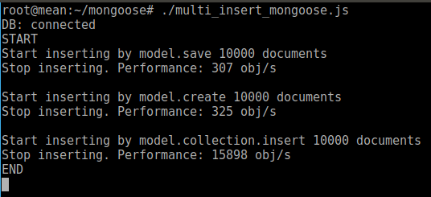
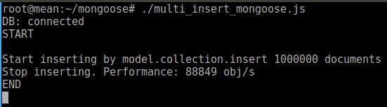

# mongoose
Useful examples on Mongoose: Multi Insert 10.000 documents on mongodb using mongoose on nodejs

# Install
```
  apt install node npm mongo-org
  mkdir mongoose
  cd mongoose
  npm init
  npm install mongoose
```
# Use multi insert
```
  cd mongoose
  ./multi_insert_mongoose.js
```
# Output


# Output when inserting 1M documents (model.collection.insert only)


#### Note
nodejs has a default maximum limit of RAM of about 1.7G: to increase it you just need to specify command line option 
```max-old-space-size```.

Example
```node --max-old-space-size=4096 index.js``` will start index.js with 4G Ram limit.
